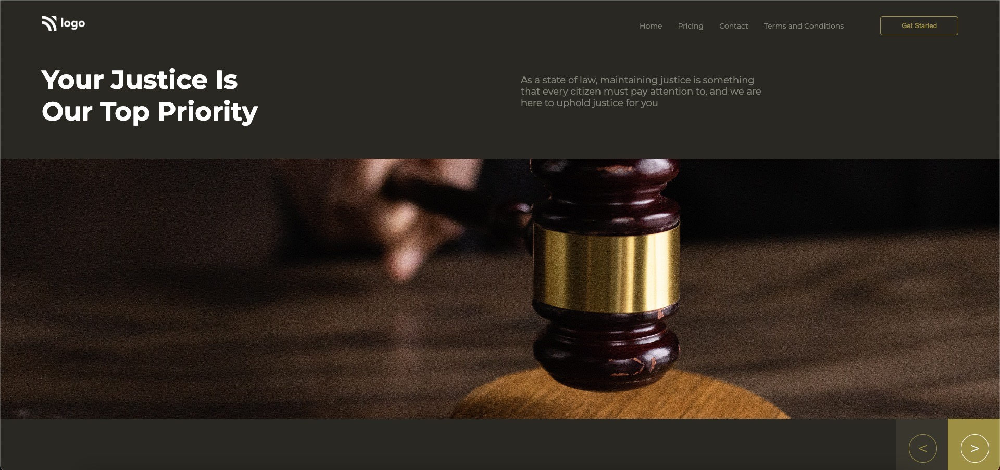

# HTML CSS Project-3 at Intecons

  

## About the Project :-

>1) The project is based on **HTML and CSS**.
>2) This project is a part of Styling Challenge Series.
 >3) **Prominent CSS properties** used are _flex_ and _position_.

## Project  _**ScreenShot**_ :-

## Project Link :- 

  
  
  
  

